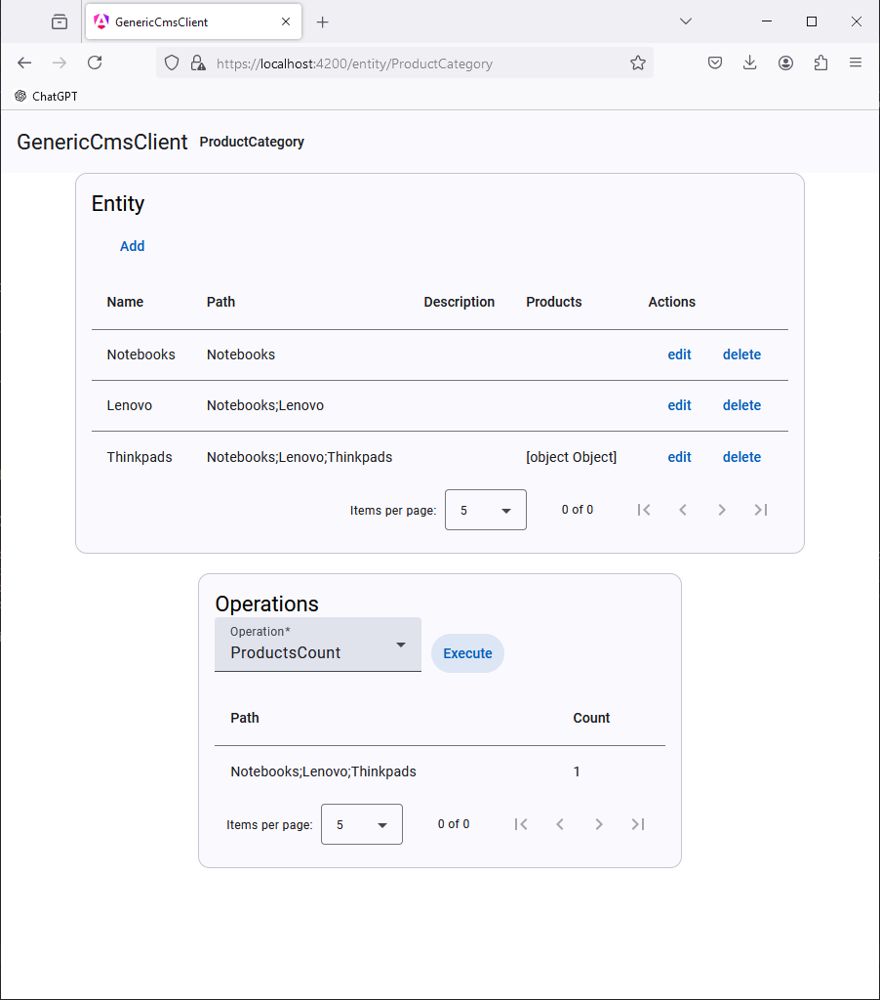
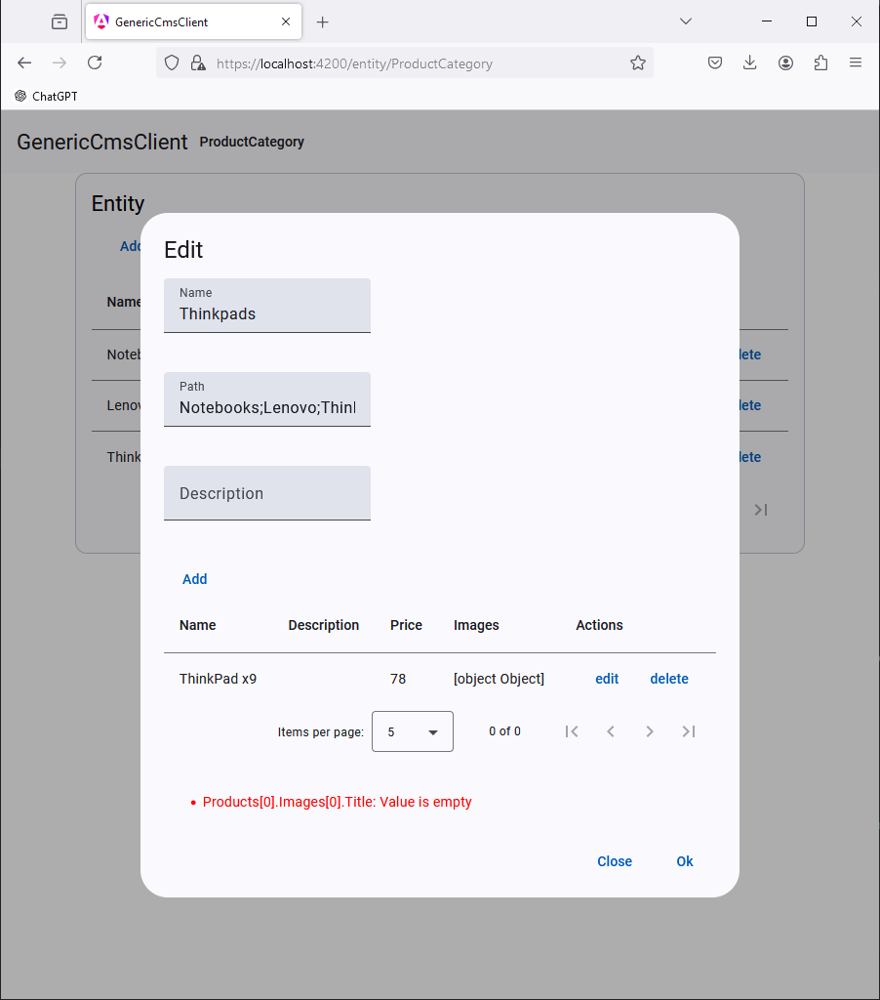
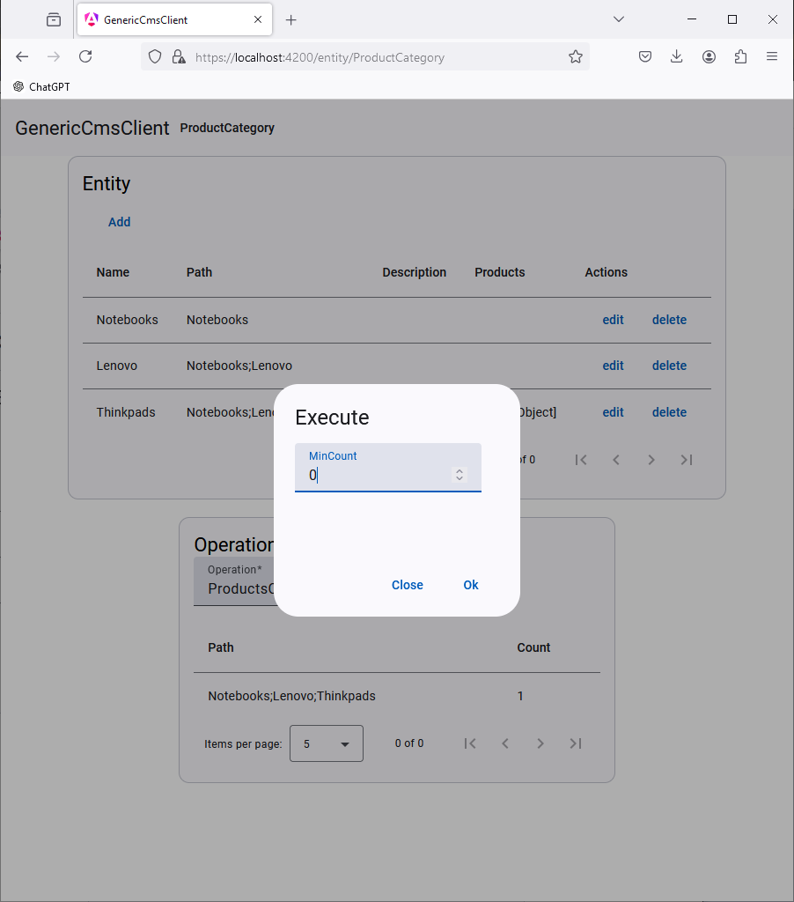

<h1 align="center">Welcome to Generic CMS Architecture👋</h1>
<p>

 
 
 

  
  
  
</p>


This repository demonstrates a generic, testable headless CMS architecture built with .NET, MongoDB, and an Angular-based admin interface. The core principle is to represent any real-world use case through entities and their operations. The CMS allows users to define entities and associate their operations using an autofac.json configuration. A single, simple, generic EntityService with custom operations is used to handle any real-world use case, ensuring both flexibility and reusability across the system.
### 🏠 [Homepage](https://github.com/david-skalka/generic-cms)

## Screenshots

### Entity list
<a href="Images/entity.png">
  
</a>

### Entity edit
<a href="Images/entity-edit.png">
  
</a>

### Execute operation
<a href="Images/execute-operation.png">
  
</a>


## Features
- Configure entities and their properties through autofact.json configuration
- Extend entity functionality by adding custom IEntityOperation, such as aggregation queries. (see ProductsCount operation in example)
- Collection property type (e.g. images of product)
- Hierarchical entity design using path pattern ( see Path property in example)
- Flexible query endpoint for accessing your store ( MongoDB json expression )
- Server side field validation rules


## Property types
- String
- Number
- Collection
- Autocomplete


## Prerequisites
- net8.0
- npm
- MongoDB 7.0


## Example
### Here’s an example of how the Entities/product-category.json properties file might look to represent the ProductCategory tree, including a list of products and their associated images:
```
[
  {
    "Name": "Name",
    "Type": "String",
    "DefaultValue": "",
    "Validators": [
      "NotEmpty"
    ]
  },
  {
    "Name": "Path",
    "Type": "Autocomplete",
    "DefaultValue": "",
    "DataProvider": {
      "Type": "EntityQuery",
      "Name": "ProductCategory",
      "Expression": {},
      "Property": "Path"
    }
  },
  {
    "Name": "Description",
    "Type": "String",
    "DefaultValue": ""
  },
  {
    "Name": "Products",
    "Type": "Collection",
    "DefaultValue": [],
    "Properties": [
      {
        "Name": "Name",
        "Type": "String",
        "DefaultValue": ""
      },
      {
        "Name": "Description",
        "Type": "String",
        "DefaultValue": ""
      },
      {
        "Name": "Price",
        "Type": "Number",
        "DefaultValue": ""
      },
      {
        "Name": "Images",
        "Type": "Collection",
        "DefaultValue": [],
        "Properties": [
          {
            "Name": "Title",
            "Type": "String",
            "DefaultValue": "",
            "Validators": [
              "NotEmpty"
            ]
          },
          {
            "Name": "Path",
            "DefaultValue": "",
            "Type": "String"
          }
        ]
      }
    ]
  }
]
```
### Here’s an example of what the autofac.json configuration might look like for registering the ProductCategory entity and adding an operation like ProductsCount
```
{
  "components": [
    {
      "type": "MongoDB.Driver.MongoClient, MongoDB.Driver",
      "services": [
        {
          "type": "MongoDB.Driver.IMongoClient, MongoDB.Driver"
        }
      ],
      "instanceScope": "singleInstance",
      "parameters": {
        "connectionString": "mongodb://localhost:27017"
      }
    },
    {
      "type": "GenericCms.Services.EntityService, GenericCms",
      "instanceScope": "singleInstance",
      "injectProperties": true,
      "properties": {
        "Name": "ProductCategory",
        "ModelPath": "Example\\Entities\\product-category.json",
        "OperationsMap": { "ProductsCount": "GenericCms.Example.ProductCategoryProductsCountOperation" }
      },
      "services": [
        {
          "type": "Autofac.IStartable, Autofac"
        },
        {
          "type": "GenericCms.Services.EntityService, GenericCms"
        }
      ]
    },
    {
      "type": "GenericCms.Example.ProductCategoryProductsCountOperation, GenericCms",
      "instanceScope": "singleInstance",

      "services": [
        {
          "type": "GenericCms.Services.IEntityOperation, GenericCms"
        }
      ]
    },
    {
      "type": "GenericCms.Services.DynamicFormService, GenericCms",
      "instanceScope": "singleInstance"
    },
    {
      "type": "GenericCms.DatabaseSettings, GenericCms",
      "instanceScope": "singleInstance",
      "injectProperties": true,
      "properties": {
        "DatabaseName": "GenericCms"

      }
    }
  ]
}
```

### Entity Query endpoint

```
curl -X 'POST' \
  'https://localhost:7000/Content/query/ProductCategory' \
  -H 'accept: text/plain' \
  -H 'Content-Type: application/json' \
  -d '{"path": {"$regex": "^Notebooks;.*" }}'
```


## Author

👤 **David Skalka**


## Show your support

Give a ⭐️ if this project helped you!

***
_This README was generated with ❤️ by [readme-md-generator](https://github.com/kefranabg/readme-md-generator)_
